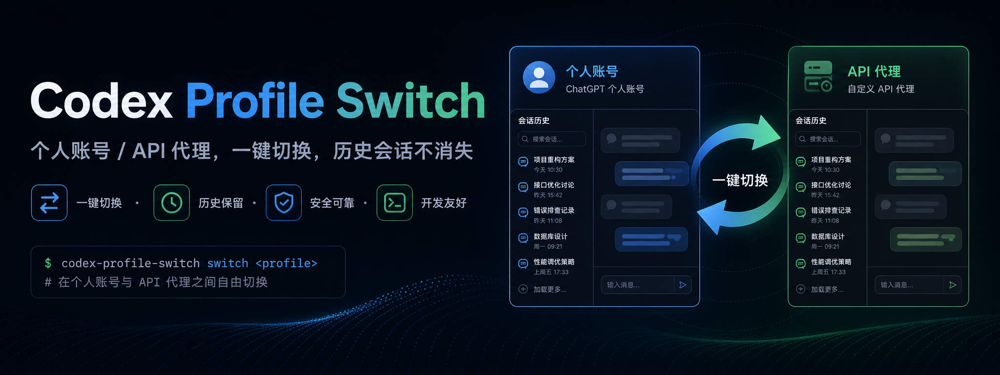
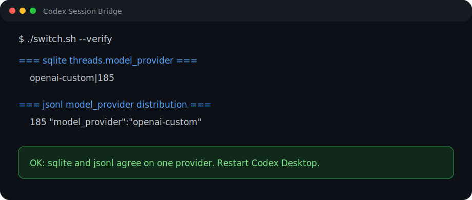

# codex-profile-switch



> 中文说明在前，English README follows below.

在 Codex Desktop 里，在 **个人 ChatGPT 账号** 和 **第三方 OpenAI 兼容 API 代理** 之间切换，同时尽量避免历史会话列表“消失”。

很多人切换 Codex 的 `model_provider` 后，会发现之前的对话不见了。其实对话没有被删除，只是 Codex 会按当前 provider 过滤会话列表。这个工具会在切换 profile 时，同步改写 jsonl 会话源文件和 sqlite 索引里的 `model_provider`，让两个账号/接口侧都能看到完整历史。

它既可以作为独立命令行工具使用，也可以作为 Claude skill 使用。



---

## 如何分享 / 如何安装这个 skill

把这个仓库链接发给别人即可：

```text
https://github.com/LXR110-bit/codex-profile-switch
```

对方如果想安装，可以直接复制下面这段命令：

```bash
git clone https://github.com/LXR110-bit/codex-profile-switch.git
cd codex-profile-switch
./install.sh
```

也可以用一行命令：

```bash
git clone https://github.com/LXR110-bit/codex-profile-switch.git && cd codex-profile-switch && ./install.sh
```

安装后有两种用法：

1. **命令行直接使用**

   ```bash
   ./switch.sh chatgpt        # 切回个人 ChatGPT 账号
   ./switch.sh api            # 切到 API 代理
   ./switch.sh --dry-run api  # 预览会改什么，不实际写文件
   ./switch.sh --verify       # 检查状态
   ./switch.sh --doctor       # 诊断环境和配置
   ```

2. **作为 Claude skill 使用**

   如果安装时选择软链到 `~/.claude/skills/`，之后可以直接对 Claude 说：

   ```text
   切 api
   切回个人账号
   codex 切档案
   switch codex to api
   ```

适合发给别人的一句话介绍：

```text
这是一个 Codex Desktop profile 切换工具，可以在个人 ChatGPT 账号和 API 代理之间切换，同时尽量避免历史会话列表消失。
```

---

## 中文快速开始

```bash
git clone https://github.com/LXR110-bit/codex-profile-switch.git
cd codex-profile-switch
./install.sh
```

安装脚本会做几件事：

- 检查依赖是否存在；
- 给 `switch.sh` 增加可执行权限；
- 可选地把本目录软链到 `~/.claude/skills/`，方便 Claude 直接调用；
- 提醒你还需要准备哪些 Codex profile 配置文件。

第一次使用前，需要准备两个配置文件：

| 用途 | 文件 | `model_provider` |
|---|---|---|
| 个人 ChatGPT 账号 | `~/.codex/config.toml.profile.chatgpt` | `openai` |
| API 代理 | `~/.codex/config.toml.profile.api` | `openai-custom` |

最简单的方式：

```bash
# 如果你当前就是个人 ChatGPT 登录态，可以先复制当前配置
cp ~/.codex/config.toml ~/.codex/config.toml.profile.chatgpt

# API 代理配置从模板开始，再编辑 base_url / 环境变量等
cp examples/config.toml.api.example ~/.codex/config.toml.profile.api
$EDITOR ~/.codex/config.toml.profile.api
```

然后切换：

```bash
./switch.sh chatgpt        # 切回个人 ChatGPT 账号
./switch.sh api            # 切到 API 代理
./switch.sh --dry-run api  # 预览会改什么，不实际写文件
./switch.sh --verify       # 检查当前 jsonl + sqlite 状态
./switch.sh --doctor       # 诊断依赖、profile、Codex 进程和数据文件
./switch.sh --help
```

每次切换后，请**重启 Codex Desktop**，这样会话列表才会按新状态刷新。

---

## 适合谁

- 月底 ChatGPT 额度不够，想临时切到 API 代理；
- 平时用个人账号，特定任务想用另一个 OpenAI 兼容接口；
- 想在多个 provider 之间切换，但不想每次切完历史对话都“看不见”；
- 想把这个能力交给 Claude skill 自动执行，而不是每次手动改配置。

---

## 中文使用说明

### 命令行模式

```bash
./switch.sh chatgpt
./switch.sh api
./switch.sh --dry-run api
./switch.sh --verify
./switch.sh --doctor
```

`--verify` 很重要：理想情况下，sqlite 和 jsonl 里都应该只剩一个 `model_provider` 值。如果出现两个值，说明迁移没完全成功，建议先不要打开 Codex，重新执行切换或排查问题。

### Claude skill 模式

运行 `./install.sh` 后，如果你选择建立软链，Claude 可以通过这些自然语言触发：

- “切 api”
- “切回个人账号”
- “codex 切档案”
- “switch codex to api”
- “switch codex to chatgpt”

Claude 执行时应该遵循：

1. 先确认 Codex Desktop 没在运行；
2. 执行 `switch.sh <target>`；
3. 执行 `switch.sh --verify`；
4. 提醒用户重启 Codex。

---

## 安全说明

- 每次切换前都会备份会改动的文件；
- Codex 正在运行时脚本会拒绝执行，避免并发写入；
- 这个工具不管理密钥：ChatGPT 登录态由 Codex 自己维护，API key 由你的环境变量或代理配置维护；
- API profile 示例里的 `base_url` 是占位符，分享前请确认没有把自己的真实代理地址或密钥写进去。

---

## 版本记录

版本记录见 [CHANGELOG.md](CHANGELOG.md)。

---

## English README


Switch [Codex Desktop](https://chatgpt.com/codex) between your **ChatGPT
personal account** and a **third-party OpenAI-compatible API proxy** without
losing your conversation history.

> Codex hides every conversation whose `model_provider` doesn't match the
> active profile. Naive profile switching makes your history "disappear" each
> time. This tool migrates the `model_provider` field across both the source
> jsonl files and the sqlite index so both sides always see the full session
> list.

Works as a standalone CLI **and** as a [Claude](https://claude.ai/code) skill.

---

## Quick start

```bash
git clone https://github.com/LXR110-bit/codex-profile-switch.git
cd codex-profile-switch
./install.sh
```

The installer checks dependencies, makes the script executable, optionally
symlinks it into `~/.claude/skills/` so Claude can invoke it, and tells you
which profile files you still need to create.

Then create your two profile files (one-time setup, see [Setup](#setup) below)
and switch:

```bash
./switch.sh chatgpt        # use ChatGPT personal account
./switch.sh api            # use API proxy
./switch.sh --dry-run api  # preview changes without writing files
./switch.sh --verify       # print current state
./switch.sh --doctor       # diagnose environment and profile setup
./switch.sh --help
```

After every switch, **restart Codex** to see your full history.

---

## Why this exists

You probably hit one of these:

- Your ChatGPT subscription quota runs out near month-end and you want to
  switch to an API proxy for a few days.
- You have one provider for sensitive/personal work and another for everyday
  coding.
- You're A/B-comparing two providers but want a unified history.

In all of those cases, the moment you change `model_provider` in Codex's
`config.toml`, your previous conversations vanish from the session list.
They're not deleted — they just get filtered out, because Codex only shows
threads whose provider matches the active one.

This tool fixes that by rewriting `model_provider` everywhere it's persisted
(jsonl session files + sqlite index) every time you switch.

## How it works (one paragraph)

Each Codex conversation has a `model_provider` field stored in
`~/.codex/sessions/YYYY/MM/DD/*.jsonl` and mirrored in
`~/.codex/state_5.sqlite`. At startup, Codex rebuilds sqlite from the jsonl,
so patching only one isn't enough. `switch.sh` patches both, after backing up
everything it touches. See [docs/HOW_IT_WORKS.md](docs/HOW_IT_WORKS.md) for
the full story, and [docs/KNOWN_ISSUES.md](docs/KNOWN_ISSUES.md) for the
gotchas the author has personally hit.

---

## Setup

You need two profile files in `~/.codex/`:

| Profile  | File                                       | `model_provider` |
|----------|--------------------------------------------|------------------|
| ChatGPT  | `~/.codex/config.toml.profile.chatgpt`     | `openai`         |
| API      | `~/.codex/config.toml.profile.api`         | `openai-custom`  |

The `examples/` directory has templates. Easiest path:

```bash
# ChatGPT profile — start from your current config if you're already on ChatGPT
cp ~/.codex/config.toml ~/.codex/config.toml.profile.chatgpt

# API profile — start from the template, edit base_url to point at your proxy
cp examples/config.toml.api.example ~/.codex/config.toml.profile.api
$EDITOR ~/.codex/config.toml.profile.api
```

Key rules:

- The ChatGPT profile must **not** redefine the built-in `openai` provider in
  `[model_providers]`. Recent Codex versions reject that with
  `Built-in providers cannot be overridden`.
- The API profile must declare `model_provider = "openai-custom"` and have a
  matching `[model_providers.openai-custom]` block with your proxy's
  `base_url`. The name `openai-custom` is hard-coded in `switch.sh` — if you
  change it, change it in three places (the script and both example files).

This tool does **not** manage credentials. ChatGPT auth comes from Codex's own
login. API auth comes from `OPENAI_API_KEY` or wherever your proxy stores it.

---

## Usage

### As a CLI

```bash
./switch.sh chatgpt        # switch to ChatGPT profile, migrate history
./switch.sh api            # switch to API profile, migrate history
./switch.sh --dry-run api  # preview changes without writing files
./switch.sh --verify       # show current jsonl + sqlite state
./switch.sh --doctor       # diagnose environment and profile setup
./switch.sh --help
./switch.sh --version
```

`--verify` is the contract: both sqlite and jsonl should show **only one**
`model_provider` value. Two values = the rewrite missed something. Don't reopen
Codex in that state (it will re-sync sqlite from the bad jsonl and bake the
inconsistency in); rerun the switch or investigate.

### As a Claude skill

After `install.sh` symlinks the directory into `~/.claude/skills/`, Claude
recognizes the trigger phrases listed in [SKILL.md](SKILL.md):

- 中文: "切 api"、"切回个人账号"、"codex 切档案" …
- English: "switch codex to api", "switch codex to chatgpt", …

Claude will:
1. Check Codex isn't running (prompt Cmd+Q if it is).
2. Run `switch.sh <target>`.
3. Run `--verify` to confirm the migration is complete.
4. Tell you to restart Codex.

---

## Safety

- Every run creates a timestamped backup at `~/.codex/jsonl_backup_<TS>/`
  containing `config.toml.bak`, `state_5.sqlite.bak`, and every jsonl that
  was rewritten.
- The script refuses to run if Codex's GUI or `app-server` is still alive —
  concurrent writes would race the migration.
- Filenames in the backup directory encode the relative path
  (`sessions_2026_05_20_rollout-xyz.jsonl.bak`) to avoid same-basename
  collisions across date subdirectories.

To roll back: stop Codex, copy `.bak` files back over the originals, restart.

Backups accumulate. Clean up monthly; keep the most recent 2–3.

---

## Compatibility

- **macOS**: tested on default `/bin/bash` 3.2.
- **Linux**: should work; bash ≥ 4 is fine. Codex Desktop is currently
  macOS-only as far as we know, so this is mostly theoretical.
- **Dependencies**: `bash`, `sqlite3`, `sed`, `find`, `grep`, `pgrep` —
  all standard on macOS/Linux.

---

## Contributing

PRs and issues welcome, especially:

- Reports of new Codex versions changing the storage format.
- Compatibility fixes for different Codex builds.
- Support for additional profile types (Azure, Bedrock, etc.) — but please
  open an issue first so we can discuss the design.

When reporting a bug, please include:

- Codex Desktop version.
- Output of `./switch.sh --verify` before and after.
- Whether you're seeing missing conversations, count mismatches, or a startup
  error.

---

## License

MIT — see [LICENSE](LICENSE).
