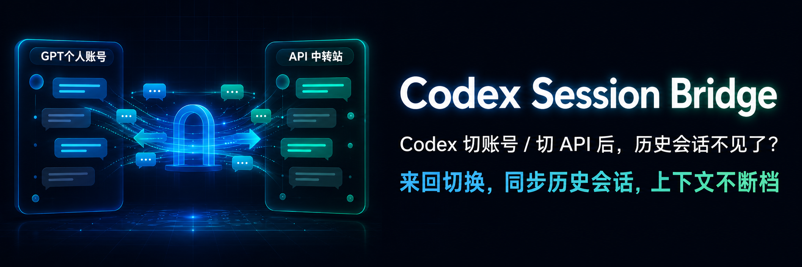
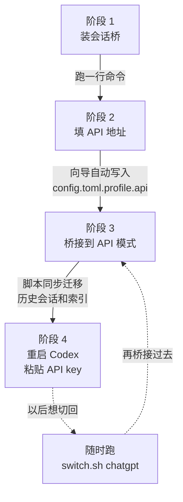
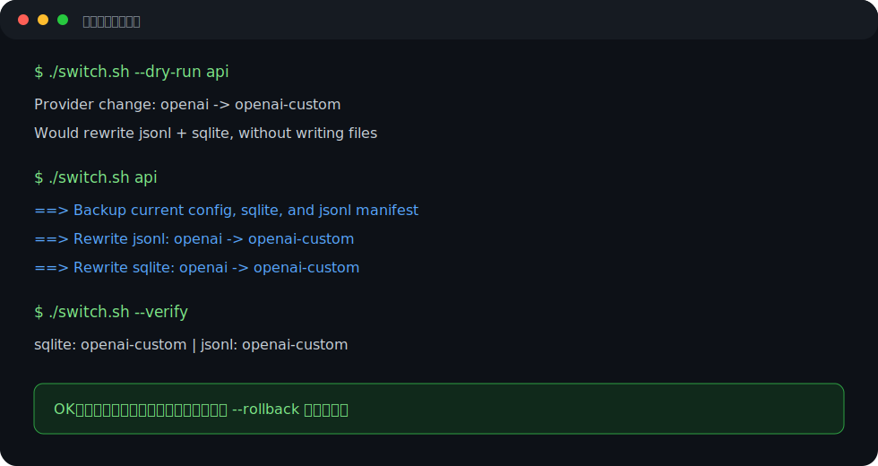

# Codex Session Bridge（Codex 会话桥）



> 中文说明在前，English README follows below.<br>
> 原名：`codex-profile-switch`。新定位：**Codex 会话连续性工具**，不是 API 管理器。

**让 Codex Desktop 在「个人账号」和「API 代理」之间来回切时，历史会话不消失、上下文不断档。**

很多工具解决的是「怎么切 API」。这个项目解决的是另一个更具体的问题：

> 切完配置之后，我原来的 Codex 会话去哪了？

你不需要会读 TOML，也不需要知道 `wire_api`、`model_provider` 是什么。第一次配置 API 代理时，跟着向导填两样东西就行：

1. API 地址，例如 `https://api.deepseek.com/v1`；
2. 默认模型，例如 `deepseek-chat`，不知道就直接回车用默认值。

API key 不需要发给 AI，也不会写进这个仓库。切到 API 模式后，Codex Desktop 会自己弹窗让你粘贴 key，并保存到 macOS Keychain。

---

## 一句话介绍

```text
Codex Session Bridge：Codex 会话桥。让 Codex Desktop 在个人账号和 API 代理之间切换时，历史会话不消失。
```

更准确地说：

```text
它不是 API switcher，而是 Codex session continuity tool。
```

---

## 如何分享 / 如何安装

当前仓库链接：

```text
https://github.com/LXR110-bit/codex-session-bridge
```

对方只需要复制这一行命令到终端里运行：

```bash
bash <(curl -fsSL https://raw.githubusercontent.com/LXR110-bit/codex-session-bridge/main/start.sh)
```

这个小白向导会自动完成：

- 下载/更新工具；
- 保存当前 Codex 个人账号配置；
- 让用户粘贴 API 地址；
- 询问是否现在桥接到 API 模式；
- 同步迁移 Codex 本地会话索引和历史 jsonl；
- 提醒重启 Codex，并由 Codex 弹窗收 API key。

> 不需要把 API key 发给 AI。key 由 Codex Desktop 自己弹窗接收，并保存到 macOS Keychain。

---

## 中文快速开始：只做 3 件事

### 你现在处在哪一步？



| 阶段 | 你要做什么 | 工具替你做什么 | 完成标志 |
|---|---|---|---|
| 1. 装会话桥 | 复制下面那行命令到终端回车 | 自动下载/更新仓库、检查依赖、可选装成 Claude skill | 看到「✅ 已存在 chatgpt profile」 |
| 2. 填 API 地址 | 粘贴 `https://api.deepseek.com/v1` 这种地址、填一个该家中转站支持的模型名 | 探测地址能不能连通、写 `~/.codex/config.toml.profile.api` | 看到「✅ HTTP 200/401 — 地址可用」 |
| 3. 桥接到 API | 选「现在桥接到 API」 | 改 `config.toml`、改 sqlite 索引、回写 jsonl 历史会话 | 看到 `--verify` 输出里 sqlite 和 jsonl 都是 `openai-custom` |
| 4. 重启 Codex | Cmd+Q 完全退出 → 重新打开 → 弹窗里粘 `sk-xxx` | 从 macOS Keychain 读 key | Codex 里能看到完整历史会话列表 |

要回到个人账号：跑 `bash switch.sh chatgpt`，重启 Codex。任何时候都可以来回切，重点是**会话列表不再割裂**。

---

### 第 1 步：复制一行命令

```bash
bash <(curl -fsSL https://raw.githubusercontent.com/LXR110-bit/codex-session-bridge/main/start.sh)
```

### 第 2 步：粘贴 API 地址

向导会问你 API 地址，例如：

```text
https://api.deepseek.com/v1
```

模型不知道填什么就直接回车。

### 第 3 步：重启 Codex

如果你选择“现在桥接到 API”，脚本会自动切换配置并迁移会话归属。

然后你只需要：

1. 完全退出 Codex Desktop；
2. 重新打开 Codex Desktop；
3. 如果 Codex 弹窗要 API key，就粘贴你的 `sk-...` key。

历史会话不会消失。

---

## 高级/手动安装

如果你不想用一行命令，也可以手动下载仓库：

```bash
git clone https://github.com/LXR110-bit/codex-session-bridge.git
cd codex-session-bridge
./start.sh
```

只想安装、不马上配置，可以运行：

```bash
./install.sh
```

只想重新配置 API 地址，可以运行：

```bash
./setup-api.sh
```

只想桥接账号/API 两种模式，可以运行：

```bash
./switch.sh api      # 桥接到 API 代理，会话历史同步过去
./switch.sh chatgpt  # 桥接回个人 ChatGPT 账号，会话历史同步回来
```

每次桥接后，请**完全退出并重启 Codex Desktop**，历史会话列表才会刷新。

---

## 常用命令

```bash
./start.sh                  # 小白向导：安装/配置/会话桥接一条龙
./setup-api.sh              # 只重新配置 API 地址
./switch.sh api             # 桥接到 API 代理
./switch.sh chatgpt         # 桥接回个人账号
./switch.sh --verify        # 检查当前会话归属状态
./switch.sh --doctor        # 诊断环境和配置
./switch.sh --dry-run api   # 只预览，不改文件
./switch.sh --list-backups  # 查看备份
./switch.sh --rollback <backup-dir> # 从备份恢复
```

---

## 和 cc-switch / ccswitch 有什么区别？

先说结论：

> **ccswitch 解决 API/provider 配置管理。Codex Session Bridge 解决 Codex Desktop 会话连续性。**

cc-switch 系列（farion1231/cc-switch、ksred/ccswitch、HamGuy/CCSwitch …）通常是**多家 AI 工具的 provider 配置管理器**：覆盖 Claude Code、Codex、Gemini CLI 等多种工具，主要功能是把不同 API key + base URL 存成预设，一键切。

这个项目不是在做另一个 API 管理器。它只服务 Codex Desktop，专门解决一个具体痛点：

> Codex Desktop 会按当前 `model_provider` 过滤历史会话。直接换 base URL 或 provider 后，旧会话会从列表里消失，看起来像被删了。

所以两件事的差别：

| | cc-switch 系列 | Codex Session Bridge（本仓库） |
|---|---|---|
| 问题类别 | API/provider 配置管理 | Codex 会话连续性 |
| 典型问题 | “我想在多个 API/provider 之间切换” | “我切完后，原来的 Codex 会话去哪了？” |
| 覆盖范围 | Claude Code、Codex、Gemini CLI 等多工具 | 只 Codex Desktop |
| 主要改动 | 各工具的 config / provider 预设 | `config.toml` + `state_5.sqlite` 索引 + `sessions/*.jsonl` 的 `model_provider` 字段 |
| 历史会话归属 | 通常不迁移 Codex 会话归属 | 同步迁移，让旧会话在新模式下继续可见 |
| 用户感知 | 换 API / 换 provider | 会话列表不中断、历史上下文不消失 |
| 形态 | 多为跨平台 GUI / 系统托盘 / CLI | 纯 bash 脚本 + 一行命令 |

**两者并不冲突**：你可以用 cc-switch 管理多个工具的 provider 预设，再用本仓库给 Codex 补上「会话归属迁移」这一步。

如果你符合下面任一条，本仓库更合适：

- 只用 Codex Desktop，不需要管 Claude Code、Gemini 那些；
- 切完发现历史会话没了，想让它们重新显示；
- 想同时使用 ChatGPT 个人账号和 API 代理，但不想让会话列表割裂；
- 这台 mac 没有 admin 权限，装不了 Homebrew / .dmg。

---

## 适合谁

- ChatGPT 额度快用完，想临时用 API 代理，但不想丢 Codex 历史会话；
- 买了 API 中转站，但不想手改 Codex 配置；
- 切换后发现历史会话“没了”，想让它们重新显示；
- 同时用个人账号和 API 代理，希望两边看到同一套会话列表；
- 不懂开发，只想复制 API 地址，然后让工具帮你处理剩下的事。

---

## 它解决什么问题

Codex Desktop 会按当前账号 / API 配置过滤历史会话。你切到 API 后，旧的个人账号会话可能看不见；切回个人账号后，API 期间的会话也可能看不见。

这些会话没有被删除，只是被过滤了。

这个工具会在每次桥接时同步处理 Codex 的会话记录和索引，让两边都能看到完整历史。




---

## 安全说明

- 不会要求你把 API key 发给 AI；
- 不会把 API key 写进仓库；
- 每次桥接前都会自动备份；
- Codex 正在运行时会拒绝改数据，避免写坏会话；
- 出问题可以用 `./switch.sh --rollback <backup-dir>` 回滚。

---

## 高级说明：profile / provider / 回滚

普通用户只需要运行 `./start.sh` 或上面的一行命令。下面是给想了解细节的人看的。

第一次使用前，工具会准备两份 Codex profile：

| 用途 | 文件 | 默认 provider |
|---|---|---|
| 个人 ChatGPT 账号 | `~/.codex/config.toml.profile.chatgpt` | `openai` |
| API 代理 | `~/.codex/config.toml.profile.api` | `openai-custom` |

如果你的 API profile 使用其他 provider 名，可以指定迁移口径：

```bash
./switch.sh api --provider my-proxy --from openai
```

查看备份：

```bash
./switch.sh --list-backups
```

从某个备份恢复：

```bash
./switch.sh --rollback ~/.codex/jsonl_backup_YYYYMMDD_HHMMSS
```

说明：v1.0.2 之后创建的备份会带 `manifest.tsv`，可以恢复 config、sqlite 和被改写的 jsonl。更早版本的备份没有 manifest，只能安全恢复 config/sqlite。


## 常见问题

### 我需要把 API 中转站地址发给 AI 吗？

不需要。普通用户直接运行 `./setup-api.sh`，在本机输入 API 地址即可。这个地址只会写到你自己的 `~/.codex/config.toml.profile.api`，不需要发到聊天里。

### 我需要把 API key 发给 AI 吗？

不建议，也不需要。

API key 不在向导里填，也不建议发到聊天里。第一次桥接到 API 后，Codex Desktop 会弹窗让你粘贴 key，并保存到 macOS Keychain。

### 为什么我配置好了 profile，Claude 才能帮我桥接会话？

因为 Claude skill 本质上是在你的电脑上调用 `switch.sh`。第一次使用前，先用 `./setup-api.sh` 生成 API profile；之后就可以直接说“桥接到 api / 切回个人账号”。

### 桥接后为什么要重启 Codex？

因为 Codex Desktop 需要重新读取配置和会话索引。每次桥接后，请重启 Codex Desktop，这样会话列表才会按新的 provider 状态刷新。

---

## CI / 贡献

本仓库已配置 GitHub Actions，会自动检查：

- `bash -n switch.sh install.sh setup-api.sh start.sh`
- `shellcheck switch.sh install.sh`
- fake `CODEX_HOME` 下的切换、验证、回滚流程

贡献说明见 [CONTRIBUTING.md](CONTRIBUTING.md)。

## 版本记录

版本记录见 [CHANGELOG.md](CHANGELOG.md)。

---

## English README

**Codex Session Bridge** keeps Codex Desktop conversations visible when you move between your **ChatGPT personal account** and an **API proxy**.

This is not an API/provider manager. It solves the session-continuity problem: after changing Codex provider/profile, old conversations may disappear from the session list even though the files still exist.

Built for non-developers: paste an API base URL, run the installer, and bridge the two Codex modes. You do not need to understand TOML, `wire_api`, or `model_provider` to get started.

API keys are not handled by this repo. Codex Desktop prompts for the key on first API use and stores it in the macOS Keychain.

---

## Quick start

```bash
git clone https://github.com/LXR110-bit/codex-session-bridge.git
cd codex-session-bridge
./install.sh
```

The installer checks dependencies, makes scripts executable, optionally symlinks the repo into `~/.claude/skills/`, and offers to run the API setup wizard when needed.

For first-time API setup:

```bash
./setup-api.sh
```

The wizard asks for your API base URL and default model, then writes `~/.codex/config.toml.profile.api` for you.

Then bridge sessions between modes:

```bash
./switch.sh chatgpt        # use ChatGPT personal account and migrate session ownership
./switch.sh api            # use API proxy and migrate session ownership
./switch.sh --dry-run api  # preview changes without writing files
./switch.sh --verify       # print current session-provider state
./switch.sh --doctor       # diagnose environment and profile setup
./switch.sh --list-backups # list backups
./switch.sh --rollback <backup-dir> # restore from backup
./switch.sh --help
```

After every bridge/switch, **restart Codex** to see your full history.

---

## Why this exists

You probably hit one of these:

- You switched Codex to an API proxy and your existing ChatGPT conversations vanished from the session list.
- You switched back to your ChatGPT account and the API-mode conversations were no longer visible.
- You use one provider for sensitive/personal work and another for everyday coding, but want a unified history.
- You are A/B-comparing two providers but do not want a split conversation list.

In all of those cases, the moment you change `model_provider` in Codex's `config.toml`, your previous conversations can vanish from the session list. They're not deleted — they just get filtered out, because Codex only shows threads whose provider matches the active one.

This tool fixes that by rewriting `model_provider` everywhere it's persisted (jsonl session files + sqlite index) every time you move between modes.

## How it works (one paragraph)

Each Codex conversation has a `model_provider` field stored in `~/.codex/sessions/YYYY/MM/DD/*.jsonl` and mirrored in `~/.codex/state_5.sqlite`. At startup, Codex rebuilds sqlite from the jsonl, so patching only one isn't enough. `switch.sh` patches both, after backing up everything it touches. See [docs/HOW_IT_WORKS.md](docs/HOW_IT_WORKS.md) for the full story, and [docs/KNOWN_ISSUES.md](docs/KNOWN_ISSUES.md) for the gotchas the author has personally hit.

---

## Setup

You need two profile files in `~/.codex/`:

| Profile  | File                                       | `model_provider` |
|----------|--------------------------------------------|------------------|
| ChatGPT  | `~/.codex/config.toml.profile.chatgpt`     | `openai`         |
| API      | `~/.codex/config.toml.profile.api`         | `openai-custom`  |

Easiest path:

```bash
# ChatGPT profile — start from your current config if you're already on ChatGPT
cp ~/.codex/config.toml ~/.codex/config.toml.profile.chatgpt

# API profile — use the interactive wizard
./setup-api.sh
```

The `examples/` directory still has templates if you prefer manual setup.

Key rules:

- The ChatGPT profile must **not** redefine the built-in `openai` provider in `[model_providers]`. Recent Codex versions reject that with `Built-in providers cannot be overridden`.
- The API profile must declare `model_provider = "openai-custom"` and have a matching `[model_providers.openai-custom]` block with your proxy's `base_url`. `setup-api.sh` writes this for you.

This tool does **not** manage credentials. ChatGPT auth comes from Codex's own login. API auth is handled by Codex Desktop's GUI prompt and macOS Keychain on first API use.

---

## Usage

### As a CLI

```bash
./switch.sh chatgpt        # bridge to ChatGPT profile and migrate history
./switch.sh api            # bridge to API profile and migrate history
./switch.sh --dry-run api  # preview changes without writing files
./switch.sh --verify       # show current jsonl + sqlite state
./switch.sh --doctor       # diagnose environment and profile setup
./switch.sh --list-backups # list backups
./switch.sh --rollback <backup-dir> # restore from backup
./switch.sh --help
./switch.sh --version
```

`--verify` is the contract: both sqlite and jsonl should show **only one** `model_provider` value. Two values = the rewrite missed something. Don't reopen Codex in that state (it will re-sync sqlite from the bad jsonl and bake the inconsistency in); rerun the command or investigate.

### As a Claude skill

After `install.sh` symlinks the directory into `~/.claude/skills/`, Claude recognizes the trigger phrases listed in [SKILL.md](SKILL.md):

- 中文: "桥接到 api"、"切 api"、"切回个人账号"、"codex 会话桥"、"codex 会话不见了" …
- English: "bridge codex sessions to api", "switch codex to api", "switch codex to chatgpt", "codex session bridge" …

Claude will:
1. Check Codex isn't running (prompt Cmd+Q if it is).
2. Run `switch.sh <target>`.
3. Run `--verify` to confirm the migration is complete.
4. Tell you to restart Codex.

---

## Safety

- Every run creates a timestamped backup at `~/.codex/jsonl_backup_<TS>/` containing `config.toml.bak`, `state_5.sqlite.bak`, and every jsonl that was rewritten.
- The script refuses to run if Codex's GUI or `app-server` is still alive — concurrent writes would race the migration.
- Filenames in the backup directory encode the relative path (`sessions_2026_05_20_rollout-xyz.jsonl.bak`) to avoid same-basename collisions across date subdirectories.

To roll back: stop Codex and run `./switch.sh --rollback <backup-dir>`.

Backups accumulate. Clean up monthly; keep the most recent 2–3.

---

## Compatibility

- **macOS**: tested on default `/bin/bash` 3.2.
- **Linux**: should work; bash ≥ 4 is fine. Codex Desktop is currently macOS-only as far as we know, so this is mostly theoretical.
- **Dependencies**: `bash`, `sqlite3`, `sed`, `find`, `grep`, `pgrep` — all standard on macOS/Linux.
